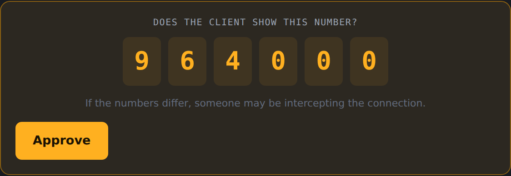
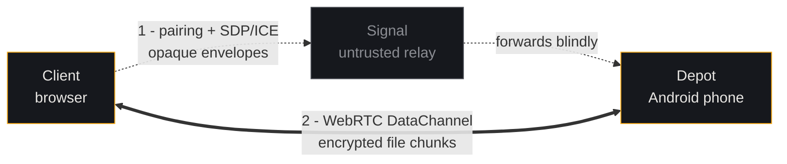
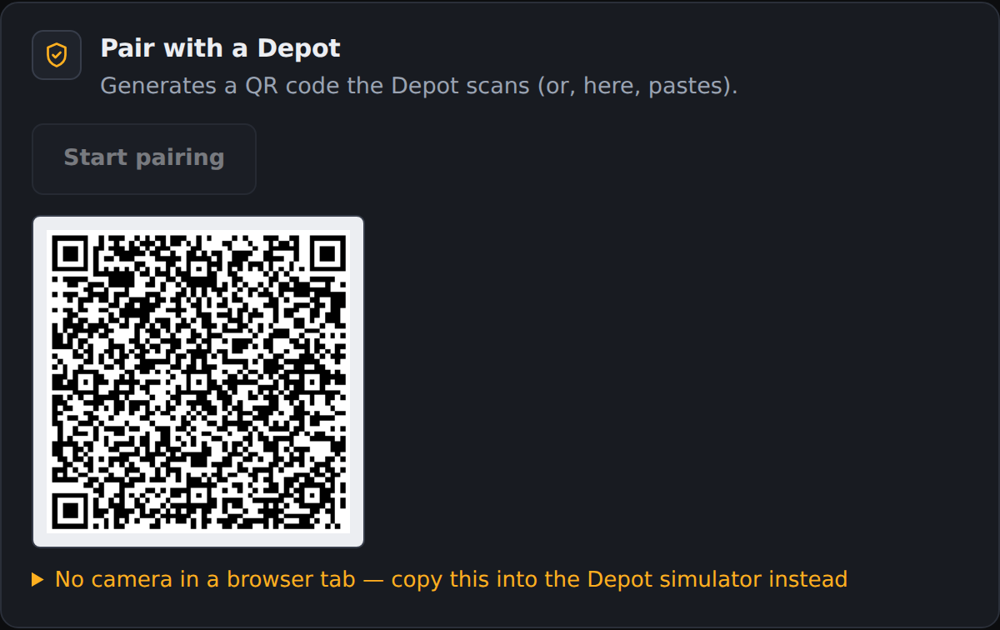
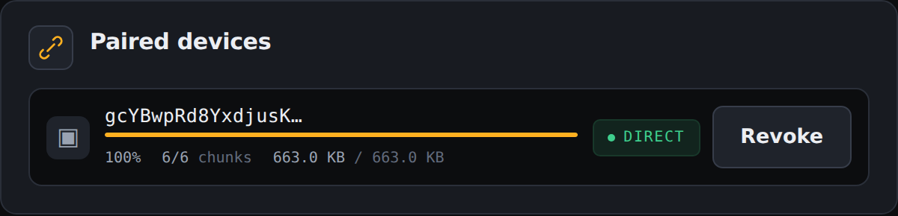
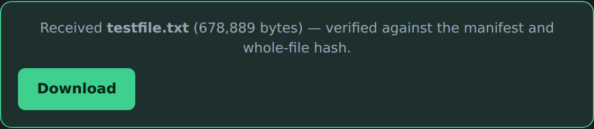

<div align="center">

# Depot

**Your phone is the file server. Your browser is the client. Nothing in between is trusted.**

Depot turns an Android phone into a personal file server that any browser can pair with —
over the internet, end-to-end encrypted, with no account, no cloud storage, and no server
that can read your files.

[](https://github.com/Abhishek-dev18/depot/actions/workflows/ci.yml)
[](docs/protocol.md)
[](signal/)
[](web/)
[](LICENSE)



</div>

---

## The idea

Cloud drives solve file access by keeping a copy of your files on someone else's computer.
Depot solves it by not moving them at all.

Your phone already holds your photos and documents, and it's already online. Depot makes it
directly reachable from a browser — pair once by scanning a QR code, and from then on any
paired browser can reconnect and pull files straight off the device over an encrypted
peer-to-peer channel.

A small relay server exists only to introduce the two sides to each other. It is assumed to
be hostile, and the protocol is built so that a hostile relay results in a *failed
connection*, never a silent compromise.

## How it works



1. **Pair** — the Client shows a QR code, the Depot scans it. Both sides run an X25519
   handshake and derive the same six-digit code from the transcript. The user compares the
   digits on both screens and approves. Matching digits prove nobody sat in the middle.
2. **Reconnect** — the Depot issues the Client a signed, expiring credential. Later sessions
   skip the QR entirely. Both sides prove who they are: the Depot signs its challenge with
   the identity the browser paired with, and the Client signs a response to it with its own.
   An impostor Depot is refused before the browser answers.
3. **Transfer** — a WebRTC DataChannel is negotiated through Signal. Files are split with
   content-defined chunking, each chunk independently encrypted, hashed and verified on
   arrival. Transfers go both ways: browse and download from the phone, or send files up
   to it.

The relay only ever forwards envelopes it cannot decrypt. It never sees key material, the
six-digit code, or file contents.

## What it does

- **Share from the phone.** Share single files, however large, or whole folders. Single
  files are read from where they live, not copied into memory. Folders are browsed
  from the browser.
- **Send to the phone.** A *Send to Depot* panel in the browser uploads into the app's own
  Inbox, which needs no folder permission, or into any folder you marked writable. Nothing
  is ever overwritten: a second `report.pdf` arrives as `report (1).pdf`.
- **Received, on the phone.** Uploads appear under *Received*. Tap to open, *Keep* to save
  straight to Downloads, swipe left to clear, or *Clear all*.
- **Previews in the browser.** Images, PDFs, text and more open in place, and anything already
  fetched is cached so it opens instantly the second time.
- **Fast when it can be.** Chunk size adapts to the link (64 KB → 256 KB → 1 MB, capped by what
  the channel accepts). Compression is used only when the data is compressible and the link
  is slow enough for it to pay off. Resumed transfers fetch only the chunks they are missing.
- **Mobile-data aware.** Treat the connection as Wi-Fi or mobile data, or let the phone decide.
  On a metered link it compresses whenever that saves bytes, even when it would not save time.
- **Light and dark.** Both the browser and the phone follow the system theme or can be set to
  light or dark: the ◐ button in the browser's nav, and *Appearance* in the app's settings. The
  launcher icon has a light variant too, used when the phone is in light mode.
- **Clear what the browser holds.** Remove one received file with ✕, or everything with
  *Clear all*. That covers whole files and the pieces kept to resume a download, and nothing
  comes back on reload. The same control is in the browser's settings.
- **Back as soon as the phone is.** A waiting browser is told the moment the phone comes online
  and reconnects by itself, without a reload.

## Security at a glance

| | |
|---|---|
| **Key agreement** | X25519 ECDH over ephemeral keys, per session |
| **Identity** | Ed25519 — long-lived `DepotIdentity` and `ClientIdentity` keypairs |
| **Reconnect** | Mutual: the Depot signs its challenge, and the Client verifies it against the paired identity *before* answering with its own signature |
| **Relay registration** | A phone registers by signing a relay-issued nonce with the key its id *is*, so knowing a Depot's id is not enough to impersonate it or knock it offline |
| **MITM defence** | 6-digit Short Authentication String derived from the full handshake transcript |
| **Encryption** | XChaCha20-Poly1305 AEAD, separate keys per direction |
| **Hashing / KDF** | BLAKE2b over a length-prefixed transcript (no field-boundary collisions) |
| **Credentials** | Ed25519-signed, 90-day expiry, silently renewed inside the last 30 days |
| **Revocation** | Depot refuses the handshake and drops live channels — it does not rely on the relay cooperating |
| **Hostile peers** | Manifests, names and sizes are validated. Decompression is capped at each chunk's declared length. Uploads are assembled on disk and published only once the whole-file hash verifies |
| **Key storage** | Android wraps the identity key with a hardware-backed Keystore key and keeps it out of backups and device transfers |

Nonces are *derived*, never transmitted — direction ‖ transfer ID ‖ chunk index for file
chunks, direction ‖ counter for control messages — so the wire carries no nonce overhead and
reuse is structurally impossible within a session.

**Both DataChannels are encrypted with the session keys, not just the file chunks.** DTLS
alone would not be enough: the SDP carrying the DTLS fingerprints is relayed through Signal,
so a hostile relay could substitute them and terminate DTLS itself. That would have left the
manifest — file name, size, every chunk hash — readable and forgeable by exactly the party
the threat model says must never see file names.

The full threat model, wire formats and design rationale live in
**[`docs/protocol.md`](docs/protocol.md)**.

## Screenshots

<table>
<tr>
<td width="50%"><br/><sub><b>Pairing.</b> The Client generates a QR code carrying its ephemeral and identity public keys.</sub></td>
<td width="50%"><br/><sub><b>Live transfer.</b> Connection type is never hidden — <code>DIRECT</code> or <code>RELAYED</code>, always visible.</sub></td>
</tr>
<tr>
<td colspan="2"><br/><sub><b>Verified receipt.</b> Every chunk is checked against the manifest, then the reassembled file against a whole-file hash.</sub></td>
</tr>
</table>

## Quick start

You need **Go 1.24+** and **Node 22+**. No Android device is required — the web app ships a
Depot simulator so the whole protocol can be exercised in two browser tabs.

```bash
git clone https://github.com/Abhishek-dev18/depot.git
cd depot

# terminal 1 — the relay
cd signal && go run .

# terminal 2 — the web client
cd web && npm install && npm run dev
```

Then open two tabs:

| Tab | URL | Plays the part of |
|---|---|---|
| 1 | <http://localhost:5173/> | the **Client** (your laptop browser) |
| 2 | <http://localhost:5173/?role=depot> | the **Depot** (stand-in for the phone) |

Walk the flow: **Start pairing** → copy the QR JSON into the Depot tab → **Join pairing** →
check the six digits match → **Approve** → pick a file to offer → **Start listening** →
back on the Client, **Reconnect**. The file arrives verified, with a download link.

## Repository layout

```
depot/
├── docs/protocol.md        # the specification — start here
├── signal/                 # Go relay server (§7)
├── web/                    # React + TypeScript client and Depot simulator
├── android/                # the Depot — Kotlin + Jetpack Compose app
├── turn/ + docker-compose.yml   # optional self-hosted coturn TURN server
└── .github/workflows/      # CI (Go, web, Android, browser e2e, emulator) and release
```

| Directory | What it is | Docs |
|---|---|---|
| [`signal/`](signal/) | Stateless WebSocket router. Matches peers by pairing session or Depot identity and forwards opaque envelopes. Holds no state across restarts. | [README](signal/README.md) |
| [`web/`](web/) | The browser Client, plus a Depot simulator that implements the phone's half of the protocol so it can be tested without Android. | [README](web/README.md) |
| [`android/`](android/) | The Depot itself: pairing by QR, folder grants, an app Inbox, a foreground service that keeps it reachable, and streamed transfers both ways. | — |
| [`docs/`](docs/) | Protocol specification, design decisions and changelog. | [protocol.md](docs/protocol.md) |

## Connectivity

ICE picks the cheapest working path: same-LAN host candidates first, then a STUN
hole-punch, and only then a TURN relay.

**This project runs no TURN server.** Most connections are direct, but two peers behind
symmetric NATs need a relay, and relaying other people's file transfers is not a cost this
project takes on. A [`docker-compose.yml`](docker-compose.yml) for coturn ships in the repo
so you can self-host one and point the Client at it in settings. When every path fails the
Client says so explicitly rather than hanging.

## Status

| Component | State |
|---|---|
| Protocol specification | ✅ Complete — pairing, reconnection, transport, revocation, design decisions resolved |
| Signal relay server (Go) | ✅ Complete — pairing rooms, signed registration, `watch` for instant reconnects, rate limiting, keepalive, race-tested |
| Web client + Depot simulator | ✅ Complete — pairing, mutual reconnection, WebRTC transport, browsing, previews, verified transfer both ways |
| Android Depot app | ✅ Built — pairing, reconnection, folder grants, app Inbox, large single files, streamed transfer both ways, network preference, foreground service |
| Client → Depot upload | ✅ Built — §5.10, into the Inbox or a writable folder, bounded by free space rather than memory |
| Release build & distribution | 🟡 A `v*` tag builds a signed APK through the release workflow when the signing secrets are set; nothing is published to a store |

> **Protocol 0.14 is not backwards compatible.** The relay, the web client and the Android app
> must be deployed together: an older app cannot register with a 0.14 relay, and a 0.14 browser
> refuses a Depot that does not sign its challenge.

The web app's Depot simulator is a development stand-in, not the product: the Android app is
the Depot. The simulator stays because it makes the whole protocol testable in two browser
tabs, which is how most of this was verified.

Two things the Android app has not been proven to do, because neither can be tested without a
handset on a real network: recover its Signal registration from a genuine connection drop, and
push §5.9's `SHARED_CHANGED` to a browser tab that is already open. Both are implemented and
both pass in the two-tab harness.

## Contributing

The specification is the source of truth: if an implementation and
[`docs/protocol.md`](docs/protocol.md) disagree, that is a bug in one of them, and which one
should be decided explicitly.

```bash
cd signal && go test ./... -race                    # relay server
cd web && npm test && npm run lint                  # client
cd android && ./gradlew testDebugUnitTest           # Depot, JVM tests only
```

CI runs all three on every push to `main` and to `claude/**`, and on every pull request,
along with two heavier suites:

- **browser** — the whole protocol through two real browser tabs against a real relay, plus
  the app mark measured in all five places it appears. Locally:

  ```bash
  cd signal && go run . &
  cd web && npm run build && npx vite preview --port 4173 &
  cd web && npm run e2e && npm run check:mark
  ```

- **vectors** — `android/app/src/androidTest/` on an emulator. `VectorsTest` is the one that
  proves Android and web derive the same keys and signatures from
  [`docs/vectors/test-vectors.json`](docs/vectors/test-vectors.json). Locally:
  `./gradlew connectedDebugAndroidTest` with a device attached.

## License

[MIT](LICENSE) © Abhishek
